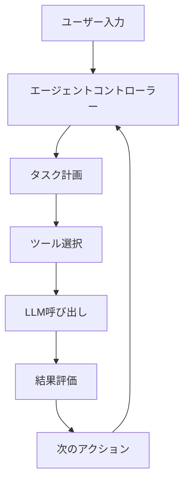

:::message
この記事は[AI Tech Media](https://ai-tech-media.example.com)の[AIエージェント実装シリーズ](#)の一部です。最新のAIエージェント開発トレンドについては[こちら](#)をご覧ください。
:::

## この記事について

AIエージェントの実装方法について解説します。具体的なコード例と実装パターンを通じて、[特定の課題や目標]を達成するための手法を学びましょう。

### 想定読者
- TypeScript/JavaScriptの基本を理解しているエンジニア
- LLMやAIサービスの基本的な知識を持つ開発者
- AIエージェントを自社サービスに組み込みたい方

### 環境要件
- Node.js 18.0以上
- TypeScript 5.0以上
- [その他必要なもの]

## 目次

## 1. AIエージェントの基本設計

### 1.1 エージェントアーキテクチャ

最新のAIエージェントは単なるLLM呼び出しではなく、複雑なアーキテクチャを持っています。以下の図はその概要です：



### 1.2 主要コンポーネント

AIエージェントの構成要素をコードで表すと次のようになります：

```typescript
interface Tool {
  name: string;
  description: string;
  parameters: Record<string, unknown>;
  execute: (params: Record<string, unknown>) => Promise<any>;
}

interface Memory {
  add: (item: any) => void;
  retrieve: (query: string) => any[];
  clear: () => void;
}

class Agent {
  private tools: Tool[];
  private memory: Memory;
  private llm: LLMInterface;

  constructor(config: AgentConfig) {
    // 初期化処理
  }

  async run(input: string): Promise<AgentResponse> {
    // エージェント実行ロジック
  }
}
```

## 2. 実装手順：ステップバイステップガイド

### 2.1 環境セットアップ

まずは必要なパッケージをインストールします：

```bash
npm init -y
npm install typescript @types/node openai langchain axios dotenv
```

`package.json`の設定:

```json
{
  "name": "ai-agent-implementation",
  "version": "1.0.0",
  "description": "AIエージェント実装ガイド",
  "main": "dist/index.js",
  "scripts": {
    "start": "ts-node src/index.ts",
    "build": "tsc",
    "dev": "ts-node-dev --respawn src/index.ts"
  },
  // 他の設定は省略
}
```

### 2.2 基本的なエージェント実装

最初のエージェントを作成しましょう。以下は基本的なテンプレートです：

```typescript
// src/agent.ts
import { OpenAI } from 'langchain/llms/openai';
import { initializeAgentExecutorWithOptions } from 'langchain/agents';
import { DynamicTool } from 'langchain/tools';
import dotenv from 'dotenv';

dotenv.config();

export async function createAgent() {
  const model = new OpenAI({
    temperature: 0,
    modelName: 'gpt-4-turbo',
    openAIApiKey: process.env.OPENAI_API_KEY
  });

  const tools = [
    new DynamicTool({
      name: "検索ツール",
      description: "最新情報を検索するためのツール",
      func: async (input: string) => {
        // 検索ロジックの実装
        return `検索結果: ${input}に関する情報`;
      },
    }),
    // 他のツールを追加
  ];

  const executor = await initializeAgentExecutorWithOptions(
    tools,
    model,
    {
      agentType: "zero-shot-react-description",
      verbose: true,
    }
  );

  return executor;
}
```

:::details コード解説
上記のコードでは、LangChainを使用して基本的なエージェントを作成しています。`OpenAI`クラスによりLLMを初期化し、`DynamicTool`でカスタムツールを定義しています。`initializeAgentExecutorWithOptions`関数でエージェントを初期化しています。
:::

## 3. パフォーマンス最適化手法

### 3.1 メモリ効率の向上

エージェントのメモリ効率を上げるための実装例：

```typescript
import { BufferMemory } from 'langchain/memory';

const memory = new BufferMemory({
  memoryKey: "chat_history",
  returnMessages: true,
  outputKey: "output"
});

// メモリ制限の実装
class LimitedMemory extends BufferMemory {
  private maxItems: number;

  constructor(options: { maxItems: number }) {
    super();
    this.maxItems = options.maxItems;
  }

  async saveContext(inputValues: Record<string, any>, outputValues: Record<string, any>) {
    await super.saveContext(inputValues, outputValues);

    // メモリアイテム数を制限
    const currentMemory = await this.loadMemoryVariables({});
    if (currentMemory.chat_history.length > this.maxItems) {
      // 古いメモリを削除するロジック
    }
  }
}
```

### 3.2 処理速度の最適化

AIエージェントの応答速度を最適化する方法：

```typescript
// 並列処理の実装
async function parallelToolExecution(tools: Tool[], query: string) {
  const promises = tools.map(tool => tool.execute({ input: query }));
  const results = await Promise.allSettled(promises);

  return results
    .filter(result => result.status === 'fulfilled')
    .map(result => (result as PromiseFulfilledResult<any>).value);
}
```

## 4. 実践的なユースケース

### 4.1 データ分析エージェント

```typescript
// データ分析エージェントの実装例
class DataAnalysisAgent extends Agent {
  constructor() {
    super({
      // 設定
    });

    this.registerTools([
      new DataLoadTool(),
      new DataCleaningTool(),
      new VisualizationTool(),
      // 他のツール
    ]);
  }

  async analyzeData(dataset: string, question: string) {
    return this.run(`データセット ${dataset} を分析して、次の質問に答えてください: ${question}`);
  }
}

// 使用例
const agent = new DataAnalysisAgent();
const result = await agent.analyzeData("sales_2025.csv", "第1四半期と第2四半期の売上比較を教えてください");
```

## 5. デバッグとトラブルシューティング

### 5.1 一般的な問題と解決法

| 問題 | 原因 | 解決策 |
| --- | --- | --- |
| エージェントが応答しない | タイムアウトが発生している | リトライ機構の実装 |
| 不適切なツール選択 | 指示が不明確 | ツール選択ロジックの改善 |
| メモリ消費過多 | コンテキストウィンドウの肥大化 | チャンク処理の実装 |

### 5.2 デバッグテクニック

```typescript
// デバッグログの実装
class DebugAgent extends Agent {
  private logEnabled: boolean;

  constructor(config: AgentConfig & { debug?: boolean }) {
    super(config);
    this.logEnabled = config.debug ?? false;
  }

  private log(message: string, data?: any) {
    if (!this.logEnabled) return;

    console.log(`[DEBUG] ${message}`);
    if (data) console.log(JSON.stringify(data, null, 2));
  }

  async run(input: string): Promise<AgentResponse> {
    this.log("エージェント実行開始", { input });

    // 処理

    this.log("エージェント実行完了", { result });
    return result;
  }
}
```

## 6. 本番環境への展開

### 6.1 スケーラビリティの考慮

```typescript
// キューベースの処理
import Queue from 'bull';

const agentQueue = new Queue('agent-tasks', 'redis://localhost:6379');

agentQueue.process(async (job) => {
  const { input, userId } = job.data;
  const agent = createAgent();

  return agent.run(input);
});

// タスク追加
agentQueue.add({
  input: "データを分析して",
  userId: "user123"
}, {
  attempts: 3,
  backoff: {
    type: 'exponential',
    delay: 1000
  }
});
```

### 6.2 モニタリングとロギング

```typescript
// モニタリング実装
class MonitoredAgent extends Agent {
  private metrics: {
    startTime: number;
    endTime: number | null;
    tokenUsage: number;
    toolCalls: number;
  };

  constructor(config: AgentConfig) {
    super(config);
    this.metrics = {
      startTime: 0,
      endTime: null,
      tokenUsage: 0,
      toolCalls: 0
    };
  }

  async run(input: string): Promise<AgentResponse> {
    this.metrics.startTime = Date.now();

    // 処理

    this.metrics.endTime = Date.now();
    this.logMetrics();

    return result;
  }

  private logMetrics() {
    console.log(`
      実行時間: ${(this.metrics.endTime! - this.metrics.startTime) / 1000}秒
      トークン使用量: ${this.metrics.tokenUsage}
      ツール呼び出し数: ${this.metrics.toolCalls}
    `);

    // メトリクスの保存や送信ロジック
  }
}
```

## 7. 今後の展望と発展方向

- **マルチモーダル入力対応**: 画像や音声入力への対応
- **自己改善機能**: エージェントの自己評価と最適化
- **フェデレーテッドラーニング**: 分散環境での学習

## まとめ

本記事では、AIエージェントの実装方法を解説しました。基本設計から実装、最適化、デバッグまでの流れを学びました。

実際の開発では、ユースケースに応じてエージェントの設計をカスタマイズすることが重要です。また、APIキー管理やセキュリティについても十分な注意が必要です。

:::message alert
本記事のコードは教育目的で提供されています。本番環境への導入前には、セキュリティやパフォーマンスの観点から十分なテストを行ってください。
:::

## 関連リソース

- [GitHubリポジトリ](#)
- [デモサイト](#)
- [技術ドキュメント](#)

## 著者について

AIエンジニアとして生成AIサービス開発に携わる[著者名]です。[経歴や専門分野の簡単な紹介]

## リファレンス

1. [LangChain公式ドキュメント](https://js.langchain.com/)
2. Smith, J. (2025). "Autonomous Agents: The Future of AI"
3. Johnson, A. et al. (2024). "Performance Optimization in LLM-based Agents"

---

この記事が皆さんのAIエージェント開発の参考になれば幸いです。質問やフィードバックはコメントでお願いします！

[議論] AIエージェントの未来についてどう思いますか？
